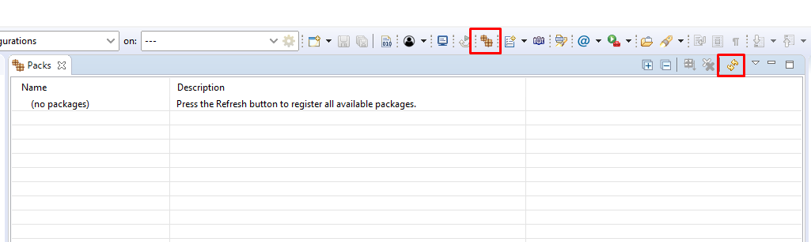
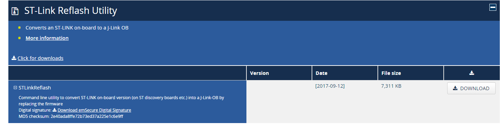

# ARM-GNS-GCC

This tutorial explains how to install GNU ARM on Windows including Eclipse consfiguration.

# Install Eclipse
Download your prefered Eclipse distribution for C Developers.  
https://www.eclipse.org/downloads/packages/  

# Install GNU MCU Eclipse Plugin
Add an update site for your eclipse:  
http://gnu-mcu-eclipse.netlify.com/v4-neon-updates  

Install all components of it.

# Install the GNU Tool Chain
Download the latest GCC ARM toolchain:  
https://developer.arm.com/open-source/gnu-toolchain/gnu-rm/downloads

# Download packs for Eclipse
This process will downlaod most of the confi files fro several vendors.  
- Select the "packs icon  
- Select the "refresh" icon  

# Update Stlink to  Jlink
Go to the following link:  
https://www.segger.com/downloads/jlink/#STLink_Reflash  

